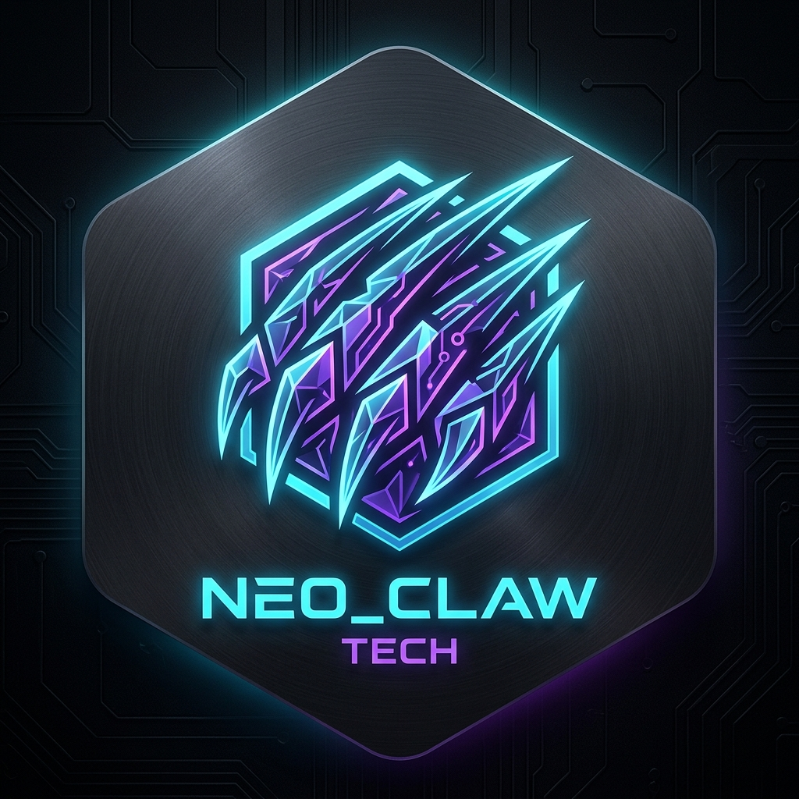

<div align="center">



# 🐾 RepoClaw

**Autonomous GitHub Issue Reproducer & Minimal Test Synthesizer**  
*The digital maintainer that turns ambiguous bug reports into verified, minimal test cases.*

[](https://opensource.org/licenses/MIT)
[](https://nodejs.org/)
[](https://www.typescriptlang.org/)
[](https://www.docker.com/)
[](https://probot.github.io/)
[](https://github.com/apps/repoclaw-app)
[](http://localhost:3000/dashboard)

**English** | [简体中文](./README.md)

</div>

---

## 💡 Why RepoClaw? (The Pain Point)

In open-source software development, maintainers are overwhelmed daily by incoming bug reports:
- **Pain Point 1: Vague reports without reproduction**: >60% of issues contain only an unformatted traceback or screenshot without a standalone test script.
- **Pain Point 2: Costly back-and-forth communication**: Maintainers repeatedly ask *"Can you provide a minimal reproduction script?"*, dragging out discussions over days or weeks.
- **Pain Point 3: Time drain**: Manually cloning, configuring environments, and attempting reproduction takes 20–45 minutes per bug.

**RepoClaw eliminates this friction.** It acts as an autonomous digital co-maintainer directly inside your repository. Maintainers trigger it simply with a ChatOps command:

```markdown
@repoclaw repro
```

**RepoClaw takes over instantly:**
1. **< 1.5s immediate feedback**: Reacts with 👀 to acknowledge the task and queues it;
2. **Zero-trust sandboxing**: Spins up an isolated, network-disabled (`NetworkMode: none`), read-only mounted container with a 30s hard timeout;
3. **Self-healing reflection agent**: Extracts error signatures via LLM, synthesizes a reproduction script, captures runtime tracebacks, and automatically self-corrects up to 3 rounds (inspired by SWE-bench / DeepSeek Harness);
4. **Automated write-back & labeling**: Labels the issue as `[reproduced]`, replies with a formatted collapsible markdown report, and upgrades the reaction to 🚀.

---

## 🎬 ChatOps in Action

```
[Maintainer]: @repoclaw repro Please help reproduce this zero division error

[RepoClaw]: (Reacts with 👀 in < 1.5s, verifies maintainer role, queues job in BullMQ)

[RepoClaw Bot]: (Executes in Docker sandbox, self-heals, and replies:)
```

<details open>
<summary><b>🤖 RepoClaw Bug Reproduction Report (Verified)</b></summary>

### 🎯 Summary
- **Target Exception**: `ZeroDivisionError`
- **Status**: ✅ **Verified & Reproduced**
- **Reflection Iterations**: 1 round
- **Total Duration**: 3,420 ms

### 💻 Minimal Reproduction Script (`repro.py`)
```python
import sys
sys.path.insert(0, '/workspace')
from my_package.calculator import calculate

# Triggers ZeroDivisionError
calculate(10, 0)
```

<details>
<summary><b>🔍 View Captured Traceback in Sandbox</b></summary>

```text
Traceback (most recent call last):
  File "/scratch/repro.py", line 6, in <module>
    calculate(10, 0)
  File "/workspace/my_package/calculator.py", line 4, in calculate
    return a / b
ZeroDivisionError: division by zero
```
</details>

---
*Synthesized and verified autonomously by [RepoClaw](https://github.com/your-org/repoclaw)*
</details>

---

## 🏛️ System Architecture

```mermaid
flowchart TD
    User([GitHub Maintainer]) -->|@repoclaw repro| Webhook[GitHub Webhook Gateway]
    Webhook --> Auth{Auth: OWNER / MEMBER / COLLABORATOR}
    
    Auth -->|Unauthorized| Deny[Block with permission warning]
    Auth -->|Authorized| Feedback[< 1.5s Add 👀 reaction]
    
    Feedback --> Queue[(BullMQ + Redis Task Queue)]
    
    subgraph Worker [RepoClaw Worker Service]
        Queue --> Consumer[Worker Process]
        Consumer --> GitClone[Shallow clone target repo]
        Consumer --> Core[Agent Self-Healing State Machine]
        
        subgraph Sandbox [Zero-Trust Docker Sandbox]
            Core --> Runner[Dockerode Runner]
            Runner --> Container["python:3.11-slim (No network / RO mount / 30s timeout)"]
        end
        
        Container --> Matcher[Traceback extraction & regex matcher]
        Matcher -->|Mismatch & Retriable| Core
        Matcher -->|Verified / Max Retries| Octokit[GitHub Octokit Write-back]
    end
    
    Octokit --> Done[Comment script + label reproduced + add 🚀]
    Consumer --> DB[(SQLite + Drizzle ORM Audit Log)]
```

---

## 🌐 Built-in Web Portal & Live Observability Dashboard

Beyond the native ChatOps interface in GitHub issue comments, RepoClaw natively hosts a high-tech dark-themed web portal directly on port 3000 via Probot Express:

- **Developer Landing Portal (`http://localhost:3000/`)**: Showcases architectural diagrams, zero-trust sandbox concepts, and a one-click "⚡ Install to GitHub" button.
- **Live Task Dashboard (`http://localhost:3000/dashboard`)**:
  - **4 Global KPIs**: Total reproduction tasks, Verified rate (%), average duration, and cumulative reflection iterations.
  - **Live Stream Table**: Real-time filtering by repository with glowing status badges (`VERIFIED`, `UNVERIFIED`, `FAILED`).
  - **Interactive Detail Drawer**: Expand any task to inspect its **minimal reproduction script (with 1-click copy)**, **captured raw traceback**, and the **full lifecycle audit trail**.

---

## 🛡️ Never Reinvent the Wheel (Core Principle)

RepoClaw strictly builds on top of battle-tested open-source components:

| Role | Solution | Rationale |
| :--- | :--- | :--- |
| **Webhook & Routing** | `probot` + `@octokit/rest` | Industry-standard GitHub App framework with built-in webhook signature verification |
| **Queue & Peak-shaving** | `bullmq` + `ioredis` | Production-grade Redis queue with exponential backoff and retry mechanisms |
| **Sandbox Isolation** | `dockerode` | Direct Docker Engine socket control for microsecond container lifecycle management |
| **LLM Structured Output** | Vercel AI SDK (`ai`) + `zod` | Declarative multi-model calling layer with native support for DeepSeek & Qwen |
| **Persistence & Audit** | `drizzle-orm` + `@libsql/client` | Ultra-fast TypeScript ORM supporting zero-compilation local SQLite files |
| **Self-Healing Loop** | `SWE-bench` / `Codex Harness` | Adopts industry-standard traceback extraction regex and self-healing state machine design |

---

## 🔒 Zero-Trust Security Sandbox

Executing untrusted code from GitHub issues is risky. RepoClaw employs defense-in-depth:
1. **Air-gapped Network**: `NetworkMode: "none"` eliminates SSRF and external egress.
2. **Read-Only Code Mount**: Target repo is mounted with `:ro`.
3. **Ephemeral Execution**: Scripts run in 64MB memory tmpfs destroyed upon completion.
4. **Hard Timeout**: 30-second hard kill with OS-level `SIGKILL`.
5. **Least Privilege**: Runs as unprivileged non-root user (`User: "1000:1000"`).

---

## 🚀 Quick Start (Docker Compose)

```bash
git clone https://github.com/your-org/repoclaw.git
cd repoclaw
cp .env.example .env

# Edit .env with your GitHub App credentials and API keys
docker compose up -d
```

---

## 🛠️ Testing

```bash
pnpm install
pnpm -r build
pnpm -r test
```

> Includes 42 unit tests covering sandbox escape prevention, regex traceback extraction, ChatOps role authorization, and Drizzle SQLite persistence.

---

## 📄 License

MIT © RepoClaw Contributors
