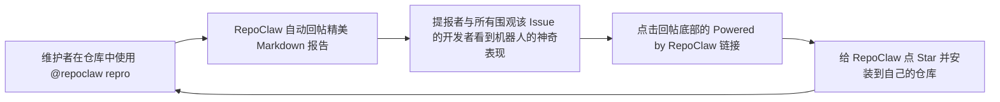

# 🚀 RepoClaw 全球开源爆款冷启动宣发指南 (Viral Launch Playbook)

> **目标**：以最强开发者共鸣、极致技术公信力与多渠道协同，助力 RepoClaw 在 GitHub 斩获高 Star，成为全球开源维护者装机必备的杀手级工具。

---

## 目录
1. [🎯 核心痛点与定位：为什么维护者会疯狂点 Star？](#1-核心痛点与定位)
2. [🐈 自裂变飞轮：ChatOps 自带的病毒式传播](#2-自裂变飞轮)
3. [🐱 Product Hunt 发布全套素材 (Launch Kit)](#3-product-hunt-发布全套素材)
4. [🍊 Hacker News (Show HN) 硬核技术贴文](#4-hacker-news-show-hn-硬核技术贴文)
5. [🤖 Reddit 社区矩阵推广指南 (r/Python, r/opensource)](#5-reddit-社区矩阵推广指南)
6. [🐦 Twitter / X 爆款 Thread 与 Demo 视频脚本](#6-twitter--x-爆款-thread)
7. [🇨🇳 国内技术社区（知乎/掘金/V2EX/公众号）推文草案](#7-国内技术社区推文草案)
8. [📈 48小时冷启动时间线与执行清单](#8-48小时冷启动时间线)

---

## 1. 核心痛点与定位

### 维护者每天面对的最大折磨：
- **"Cannot Reproduce"**：60% 以上的 Issue 只有两行报错或截图，根本无法直接调试；
- **反复拉扯**：维护者不得不反复回复 *"Can you provide a minimal reproducible example?"*；
- **时间黑洞**：配置本地环境、手工写测试、排查依赖，平均每个 Bug 消耗 30+ 分钟。

### RepoClaw 的杀手级解答：
> **“在 Issue 评论区敲 `@repoclaw repro`，30秒内，一个在隔离沙箱中跑通的最小复现测试脚本与真实堆栈直接送达。”**

---

## 2. 自裂变飞轮：ChatOps 自带的病毒式传播 (The Viral Loop)

RepoClaw 拥有传统 CLI/库所不具备的**天然网络效应**：



**关键细节**：确保机器人的每一次回复末尾都带有一键跳转的 GitHub 徽章与链接：
```markdown
---
*🐾 由 [RepoClaw](https://github.com/ddddxz/repoclaw) 自动化受限沙箱自主合成与验证 · 欢迎 [安装至您的仓库](https://github.com/apps/repoclaw-app)*
```

---

## 3. Product Hunt 发布全套素材

- **Product Name**: RepoClaw
- **Tagline**: The digital co-maintainer that turns vague GitHub issues into verified, minimal test cases
- **Categories**: Developer Tools, Open Source, Artificial Intelligence, GitHub Apps

### First Maker Comment (首条发布者留言模板):
> Hey Product Hunt! 👋
> 
> I’m @ddddxz, creator of **RepoClaw**.
> 
> If you’ve ever maintained an open-source repo, you know the pain: an issue comes in titled *"app crashes on startup"*, with no repro script, no environment details, and a 50-line truncated stack trace. You spend the next 3 days playing detective just to get a minimal test case.
> 
> We built RepoClaw to automate this chore away.
> 
> **How it works:**
> 1. In any GitHub issue, type `@repoclaw repro`.
> 2. RepoClaw shallow-clones your repo into an **air-gapped, zero-trust Docker sandbox** (read-only mount, no network access, 30s hard timeout, anti-fork-bomb).
> 3. An LLM agent synthesizes a minimal reproduction script and runs it in the sandbox. If it fails due to imports or setup quirks, it self-heals in a reflection loop (inspired by SWE-bench).
> 4. Once verified, RepoClaw labels the issue `[reproduced]`, replies with the standalone runnable script and stack trace, and marks the comment with 🚀.
> 
> It's 100% open-source under MIT, supports self-hosting via `docker compose up -d`, and works with any OpenAI-compatible LLM (DeepSeek, Qwen, Claude, GPT).
> 
> Check out the repo on GitHub: https://github.com/ddddxz/repoclaw
> 
> I’d love your feedback! What language should we support next after Python? 🐾

---

## 4. Hacker News (Show HN) 硬核技术贴文

> **HN 黄金法则**：严禁营销腔调，必须强调**架构深度**、**安全沙箱实现**与**工程设计权衡**。

- **Title**: Show HN: RepoClaw – Autonomous Bug Reproducer and Test Synthesizer for GitHub Issues
- **Link**: https://github.com/ddddxz/repoclaw

### Text 内容：
```markdown
Hi HN,

I built RepoClaw (https://github.com/ddddxz/repoclaw) to address one of the biggest time sinks in open-source maintenance: converting ambiguous bug reports into minimal, reproducible test scripts.

Instead of writing another generic AI coding assistant, RepoClaw is designed as a standalone digital maintainer that works purely via ChatOps: you comment `@repoclaw repro` on any issue.

### Security Architecture (Zero-Trust Sandbox)
Running arbitrary synthesized code triggered by untrusted issue bodies is dangerous. We built a strict Dockerode isolation layer:
- Network isolation: `NetworkMode: "none"` (no egress, no SSRF, no data exfiltration)
- Read-only code: Repository code is mounted `:ro` so the runner cannot alter the codebase
- Ephemeral execution: Scripts are executed in an isolated 64MB `tmpfs`
- cgroups bounds: 512MB RAM, 1 CPU core, and `PidsLimit: 64` to prevent fork bombs
- Hard kill: 30-second hard SIGKILL timeout
- Rootless: Runs under `User: 1000:1000`

### Self-Healing Reflection Loop
A naive LLM script often fails on `ModuleNotFoundError` or invalid paths. RepoClaw adapts regex and traceback frame extraction patterns from SWE-bench / Codex Harness. When the execution fails to reproduce the target exception, the traceback is fed back into a multi-round reflection state machine (up to 3 retries) to mutate inputs or adjust imports until the exact target error is verified.

### Stack
- Monorepo: TypeScript (pnpm workspace + Turborepo)
- GitHub Gateway: Probot + Octokit (webhook signature verification & role check: OWNER/MEMBER/COLLABORATOR)
- Queue: BullMQ + Redis for asynchronous peak-shaving
- Persistence: Drizzle ORM + LibSQL / SQLite for task audit trails
- LLM: Vercel AI SDK (compatible with DeepSeek-V3, Qwen-2.5-Coder, OpenAI)

The project is MIT-licensed: https://github.com/ddddxz/repoclaw
I'd love to hear your thoughts on the sandboxing model and prompt reflection strategies!
```

---

## 5. Reddit 社区矩阵推广指南

### 目标板块：
1. **r/Python**: 强调 Python 依赖探测、`sys.path` 自动注入与 `pytest` 可用性；
2. **r/opensource**: 强调如何为开源维护者每天节约 1 小时沟通时间；
3. **r/programming**: 强调容器防逃逸机制与 SWE-bench 堆栈比对算法。

### r/Python 贴文标题与提要：
- **Title**: *I built an open-source tool that turns vague Python bug reports into standalone test cases in Docker*
- **Tone**: 谦虚、技术探讨。
- **重点点睛**：
  - 自动探测 `pyproject.toml`、`setup.py` 与单文件包；
  - 提取出的最小测试用例可以直接复制到 `tests/test_repro.py` 中作为测试用例提交。

---

## 6. Twitter / X 爆款 Thread

### 🧵 Tweet 1 (Hook + 视频/动图)
> Every open-source maintainer knows this pain:
> 
> 🔴 "Your library is broken!"
> 💬 "Can you provide a minimal reproduction script?"
> 🦗 *crickets for 3 weeks...*
> 
> Today, I'm open-sourcing **RepoClaw** 🐾
> 
> Comment `@repoclaw repro` on any issue. In 30s, it runs in a secure sandbox & writes the test script for you.
> 
> 🧵👇 [Attach animated GIF of @repoclaw repro]

### 🧵 Tweet 2 (Core Tech)
> How does RepoClaw work under the hood?
> 
> 1️⃣ Probot validates maintainer permissions (no token spam)
> 2️⃣ Enqueues via BullMQ
> 3️⃣ Boots an air-gapped Docker sandbox (NetworkMode: none, readonly mount, 512MB RAM, PidsLimit: 64)
> 4️⃣ Self-heals up to 3 rounds using SWE-bench traceback parsing

### 🧵 Tweet 3 (Call to Action)
> 100% open-source under MIT.
> 
> ⚡ 1-click install official GitHub App
> 🐳 Or run locally: `docker compose up -d`
> 
> Star the repo & try it on your projects:
> https://github.com/ddddxz/repoclaw
> 
> Feedback & RTs appreciated! ❤️

---

## 7. 国内技术社区推文草案 (知乎 / 掘金 / V2EX)

- **标题**：《开源了一个 GitHub 杀手级工具：在 Issue 评论区敲 `@repoclaw repro`，AI 自动在沙箱里跑出最小复现用例》
- **框架**：
  1. **开头**：开源维护者的切肤之痛与情绪共鸣；
  2. **产品实测**：贴出真实 Issue 的 ChatOps 动图与生成的精简 Markdown；
  3. **硬核架构**：
     - 为什么通用基建绝不手写？（Probot, BullMQ, Dockerode, Vercel AI SDK）；
     - 零信任沙箱防逃逸与防 Fork 炸弹的 6 道防线；
     - 借鉴 SWE-bench 的多轮自愈反思状态机；
  4. **开源地址与一键体验**：求 Star 与交流讨论。

---

## 8. 48小时冷启动时间线

| 时间节点 | 行动项 | 目标指标 |
| :--- | :--- | :--- |
| **Day 0 - 20:00** | 推送 GitHub 仓库公开，检查 Release Tag `v1.0.0`，确保 CI 全绿 | 仓库公开，门面就绪 |
| **Day 1 - 09:00 (美西)** | 提交 Hacker News (Show HN) 与 Product Hunt | 获取首波海外技术极客关注 |
| **Day 1 - 10:00** | 发布 Twitter / X Thread 并 @ 知名开源博主 | 获得转推，引流 GitHub |
| **Day 1 - 14:00 (北京)** | 发布知乎/掘金/V2EX 技术长文 | 激发国内开发者讨论，冲榜 GitHub Trending |
| **Day 2 - 20:00** | 回复所有 HN/Reddit 评论与 GitHub Issue，发布第一个 PR 互动 | 提升社区活跃度与 Star 留存率 |
