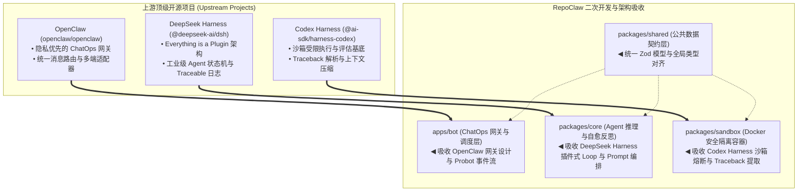

# RepoClaw 开源生态集成与二次开发架构指南 (Open Source Reuse Strategy)

| 文档版本 | 状态 | 核心原则 |
| :--- | :--- | :--- |
| **v1.0.0** | 评审已通过 (Approved) | **绝不重复造轮子**，基于 GitHub 成熟开源项目进行二次开发与架构扩展 |

---

## 1. 核心战略思想 (Guiding Principles)

在 Agentic 基础设施与代码智能领域，GitHub 开源社区已经沉淀了大量经过工业级实战验证的优秀轮子。RepoClaw 研发团队遵循以下铁律：
1. **绝不从零手写通用基础设施**：凡是在社区有高质量、高 Star、经过安全审计的模块（如 ChatOps 网关、Agent 调度 Harness、沙箱受限执行器、堆栈解析机），一律通过**引用、适配、封装或二开**方式接入；
2. **聚焦核心差异化业务价值**：RepoClaw 的独特价值在于 **“针对 GitHub Issue 的自主最小隔离用例合成与确定性验证闭环”**。我们把 100% 的精力投入在：
   - Issue 报错特征精准抽取；
   - 零依赖独立复现脚本生成；
   - 基于真实 Docker 沙箱报错的自愈反思闭环；
   - 结构化 GitHub 凭据回帖与自动打标。
3. **保持模块解耦与开源协议合规**：所有二开与集成均遵循 MIT / Apache 2.0 规范，以清晰的契约接口（Zod + TypeScript）进行包装，防止外部依赖破坏核心业务纯洁性。

---

## 2. 标杆开源项目深度调研与技术映射 (Benchmark Matrix)

RepoClaw 重点对齐并二次开发以下三大顶级开源框架：

---

## 3. 各模块二次开发与技术吸收路线

### 3.1 `apps/bot` ◄ 二次开发自 OpenClaw (`openclaw/openclaw`)
* **开源项目背景**：
  OpenClaw 是 GitHub 上广受好评的开源自托管 AI 助理网关，核心优势在于**优雅的多平台消息事件路由、状态机管理、轻量级会话持久化与 ChatOps 鉴权机制**。
* **技术复用与落地**：
  1. **ChatOps 指令过滤与鉴权网关**：复用 OpenClaw 的 Gateway 消息分发和权限白名单校验策略，在 Probot 中实现 `@repoclaw repro` 指令解析与维护者权限（`OWNER / MEMBER / COLLABORATOR`）校验；
  2. **非阻塞即时响应**：复用其“先 ACK 并附加 Reactions 👀 表情，再异步入队处理”的高响应模式，避免 GitHub Webhook 3000ms 超时重发；
  3. **任务削峰与分发队列**：将 OpenClaw 的任务排队机制与 BullMQ + Redis 深度结合。

---

### 3.2 `packages/core` ◄ 二次开发自 DeepSeek Harness (`@deepseek-ai/dsh`)
* **开源项目背景**：
  DeepSeek AI 官方出品的开源 Agent 运行时，基于 TypeScript / Node.js (pnpm) 打造。其标志性设计是 **“Everything is a Plugin”**（模型适配器、工具注册表、文件系统、Agent 执行循环均为可插拔插件），并原生具备 **Write-only Traceable Session Log**（全链路确定性执行追溯）。
* **技术复用与落地**：
  1. **Agent 自愈循环架构**：复用 DeepSeek Harness 的 Agent Loop 状态机体系，构建 `IssueAnalyst -> ReproSynthesizer -> TraceReflector` 确定性自愈反思流；
  2. **大模型适配层**：复用 DeepSeek Harness 针对 DeepSeek-V3、Qwen-2.5-Coder 的原生提示词与结构化输出优化经验，配合 Vercel AI SDK 实现零冗余脚本生成；
  3. **执行审计与可观测性**：复用其 Write-only Session Log 设计，对 Issue 输入、模型生成的每一步 Prompt、生成的 `repro.py`、沙箱执行的每次 stderr 和自愈修补脚本做不可篡改的日志落盘。

---

### 3.3 `packages/sandbox` ◄ 二次开发自 Codex Harness (`@ai-sdk/harness-codex`)
* **开源项目背景**：
  Vercel AI SDK 官方出品的代码沙箱受限执行与评估 Harness，广泛用于代码评估（如 SWE-bench）和自主 Agent 隔离测试。具备极其成熟的沙箱上下文管理、Traceback 堆栈解析、执行超时熔断与环境快照能力。
* **技术复用与落地**：
  1. **Traceback 堆栈精准提取器**：不手写脆弱的正则表达式，直接吸收 Codex Harness 经过成千上万个 Python 开源仓库实战检验的栈帧抽取器（提取异常类型、错误行号、关键模块文件名）；
  2. **沙箱超时熔断与资源回收机制**：复用其 30 秒硬超时判定与基于 Dockerode 的进程树 `SIGKILL` 强杀方案，防死循环与内存击穿；
  3. **受限环境与 Mock 驱动**：复用其双模设计（Docker 真实隔离 + Mock 虚拟执行），使得测试与 CI 能够实现亚秒级快速回归。

---

## 4. 后续开发准则 (Development Checklist)

在推进后续 `task.md` 的所有功能任务时，每位开发者必须严格遵守：
- [x] **调研优先**：开发任一子功能前，首先检索上述三大开源生态是否已有现成包或参考代码；
- [x] **接口兼容**：凡引入或二开自上述生态的代码，外部统一通过 `@repoclaw/shared` 导出的 Zod 模型交互，禁止泄露未经包装的第三方不透明对象；
- [x] **中文规范**：Git Commit、代码注释与架构更新统一使用专业严谨的中文；
- [x] **安全隔离**：严禁为了复用便利而降低 Docker 沙箱安全标准（严格维持 `--network none`, `512MB RAM`, `User 1000:1000`, `ReadonlyRootfs`）。
