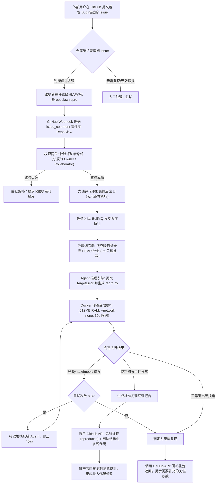

# RepoClaw 产品需求文档 (PRD - Product Requirement Document)

| 文档版本 | 状态 | 负责人 | 目标受众 |
| :--- | :--- | :--- | :--- |
| **v1.0.0** | 评审已通过 (Approved) | RepoClaw 架构组 | 开源贡献者、项目维护者、核心研发 |

---

## 1. 产品背景与定位 (Product Background & Positioning)

### 1.1 背景与行业痛点
在开源软件与大型协作项目中，**Bug 报告的质量参差不齐**是导致维护者倦怠（Maintainer Burnout）的头号原因：
1. **复现成本极高**：超过 70% 的 Issue 仅包含模糊的文字描述或不完整的代码片段，维护者需要耗费数十分钟在本地配置特定分支、安装依赖、手工编写调试代码尝试复现；
2. **缺乏回归测试基底**：即使维护者手工验证了 Bug，也往往因为耗时过长而未沉淀为标准的自动化测试用例，导致未来代码迭代中再次出现回归（Regression）；
3. **现有工具错位**：市面上的 Coding Agent（如 Devin、SWE-agent、OpenHands）全部把重点放在**“直接写代码修复 Bug”**，忽略了在真实工程世界中，**“复现 Bug 并提取最小隔离用例”才是修复代码的前提与试金石**。

### 1.2 产品定位 (Value Proposition)
**RepoClaw** 是一个面向 GitHub 仓库的 **“自主 Bug 复现与最小用例合成”数字维护者（Autonomous Issue Reproducer & Test Synthesizer）**。
它作为一个常驻的 GitHub App，以**纯 ChatOps 授权交互**为入口，在严格安全隔离的 Docker 沙箱中，自主阅读 Issue、浅克隆仓库、推导触发逻辑、合成最小独立复现脚本并真实执行，最终将经过验证的复现测试用例与调用堆栈结构化回写到 GitHub 评论区，打上 `reproduced` 标签。

---

## 2. 目标用户与使用画像 (User Personas)

1. **开源仓库维护者 (Repo Maintainer)**：
   * **痛点**：每天面对几十个新 Issue，疲于在本地一个一个拉分支复现；
   * **期望**：在 Issue 下评论一条指令，机器人自动在云端复现，给出一段可直接复制进 `tests/` 的最小代码。
2. **外部贡献者 / 提报者 (Issue Reporter)**：
   * **痛点**：不知道自己提供的信息是否足够，常常被维护者直接打上 `needs-repro` 并不再理睬；
   * **期望**：机器人快速介入验证，如果缺少信息能给出清晰具体的补充指引。

---

## 3. 核心业务流程 (End-to-End User Flow)

---

## 4. 详细功能需求 (Functional Requirements)

### 4.1 权限控制与触发机制 (FR-1)
* **FR-1.1 显式 ChatOps 触发**：仅当带有 `issues` 权限的评论中包含 `@repoclaw repro`（大小写不敏感）时触发；
* **FR-1.2 严格的角色鉴权**：通过 GitHub API 校验触发者的 `author_association`，必须为 `OWNER`、`MEMBER` 或 `COLLABORATOR`。外部普通用户的触发指令直接过滤，从根源杜绝刷单与 Token 盗刷；
* **FR-1.3 即时交互反馈**：收到合法请求后，必须在 1.5 秒内对该评论调用 Reactions API 添加 `eyes`（👀）表情，并在结束时根据结果更新为 `rocket`（🚀）或 `confused`（😕）。

### 4.2 隔离执行与沙箱保障 (FR-2)
* **FR-2.1 极速浅克隆**：以 `git clone --depth 1 --single-branch` 方式克隆仓库最新 commit，耗时必须小于 3 秒；
* **FR-2.2 绝对安全的容器环境**：
  * 宿主机代码目录以只读方式（`:ro`）挂载进容器 `/workspace`；
  * 执行脚本写入独立的 64MB `tmpfs` 内存空间 `/scratch/repro.py`；
  * 容器禁止外网连接（`NetworkMode: none`），防止反弹 Shell 与挖矿；
  * 硬性限制：内存 512MB、CPU 1.0 核、最大存活时长 30 秒（超时自动发送 `SIGKILL`）。

### 4.3 Agent 意图推导与代码合成 (FR-3)
* **FR-3.1 异常特征提取**：从 Issue 标题和正文中结构化提取预期的异常类名（`targetExceptionName`）及核心报错关键词；
* **FR-3.2 最小测试用例合成**：引导大模型编写具备**零外部冗余依赖**的单文件测试脚本，正确导入被挂载的仓库包；
* **FR-3.3 分层自愈反思重试 (Self-Healing Reflection Loop)**：
  * 若沙箱执行抛出 `SyntaxError` 或 `ModuleNotFoundError`，提取 stderr 作为 Feedback 反哺大模型，自动修改 import 路径重新执行；
  * 单个任务最多自愈反思 **3 轮**，超过上限判定复现未完成，保护资源消耗。

### 4.4 状态流转与 GitHub 回帖规范 (FR-4)
* **FR-4.1 成功回帖（Verified Report）**：
  * 为 Issue 自动添加标签：`reproduced`；
  * 回帖采用清晰高亮折叠块（`
`），包含：
    1. **最小复现代码（Python）**：可以直接加入仓库 `tests/` 的标准代码；
    2. **真实捕获的 Traceback**：带源文件行号的报错调用栈；
    3. **环境参数指纹**：运行时 Python 版本、耗时、重试轮数。
* **FR-4.2 失败追问（Clarification Request）**：
  * 保持客观礼貌，回帖附带 Agent 尝试运行过的脚本以及沙箱的真实输出，说明在当前默认参数下未观察到异常，请求提报者补充边界入参。

---

## 5. 非功能性需求 (NFR - Non-Functional Requirements)

| 指标 | 要求 | 验收方式 |
| :--- | :--- | :--- |
| **端到端响应时延** | 90% 的复现任务在 **15 秒内**完成全流程并回帖 | 日志统计 `started_at` 到 `commented_at` |
| **并发承载能力** | 单台 2C4G 实例稳定支持 **5 个容器并发**执行而不 OOM | 压力测试 BullMQ 队列 |
| **持久化审计** | 每一笔任务的状态、耗时、Token 消耗必须本地落盘 | SQLite 数据库记录完整 |
| **部署与上线门槛** | 单个 `docker-compose up -d` 即可在任一 Linux 服务器拉起上线 | 自动化部署验证 |

---

## 6. 范围界定与版本规划 (Scope & Out-of-Scope)

* **V1.0 支持范围 (In-Scope)**：
  * GitHub 公共与私有仓库（Python 生态优先，支持 `pyproject.toml` / `setup.py` / 单文件库）；
  * ChatOps 交互（`@repoclaw repro`）；
  * SQLite 审计日志与控制台输出。
* **V1.0 明确不支持 (Out-of-Scope)**：
  * 自动修改代码并提交 Pull Request（遵循单一职责，避免低质量代码噪音）；
  * 编译型语言支持（如 C++、Rust、Go 的全量编译环境，将在 V2.0 考虑扩展）。
