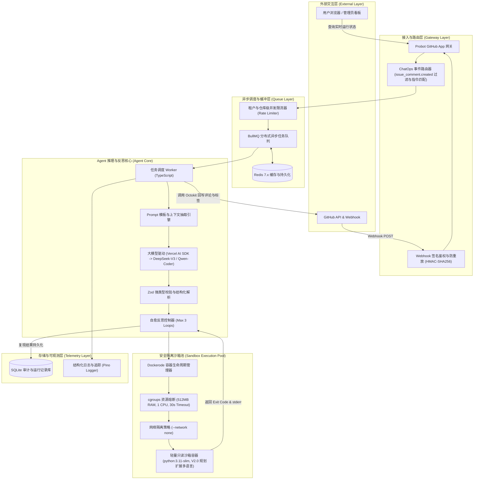
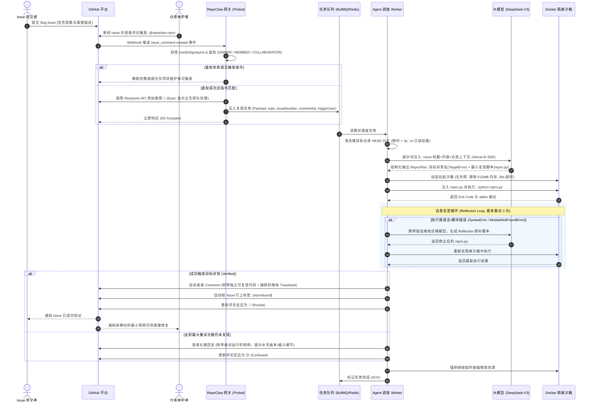

# RepoClaw 系统架构与设计说明书

## 1. 系统概述 (System Overview)
**RepoClaw** 是一个面向 GitHub 开源仓库的自主 Bug 复现与最小用例合成数字维护者（Autonomous Issue Reproducer & Test Synthesizer）。
系统基于 **TypeScript / Node.js** 全栈生态构建，以 **GitHub App (Probot)** 形式常驻运行。当开源仓库维护者在 Issue 评论区通过 ChatOps 指令（如 `@repoclaw repro`）显式触发时，系统通过严格权限校验后自动拉起受限隔离的 Docker 容器沙箱，依托大模型驱动的 Agentic 确定性反馈自愈闭环，自主分析 Issue 意图、合成最小独立复现脚本、在沙箱中执行并验证报错堆栈，最终在 GitHub 对应 Issue 评论区结构化回写复现代码与 Traceback，并自动打上 `reproduced` 状态标签。

---

## 2. 系统用例图 (Use Case Diagram)

```mermaid
flowchart LR
    subgraph Users ["参与角色 (Actors)"]
        Reporter["外部贡献者/用户 (Issue Reporter)"]
        Maintainer["开源项目维护者 (Maintainer)"]
    end

    subgraph GitHub ["GitHub 平台"]
        GH_Issue["Issue 事件流"]
        GH_Comment["Issue 评论区与标签"]
    end

    subgraph RepoClaw ["RepoClaw 系统用例"]
        UC1(["提报包含 Bug 描述的 Issue"])
        UC2(["手动触发复现 (@repoclaw repro)"])
        UC3(["自动提取错误特征与环境意图"])
        UC4(["动态拉起安全受限沙箱 (Docker)"])
        UC5(["合成最小独立复现脚本 (repro.py)"])
        UC6(["执行测试并捕获 Traceback"])
        UC7(["Agent 自愈反思重试 (Reflection Loop)"])
        UC8(["回贴已验证凭据与自动打标 [reproduced]"])
        UC9(["礼貌追问缺失的关键复现环境"])
        UC10(["查看系统执行监控看板 (Dashboard)"])
    end

    Reporter --> UC1
    UC1 --> GH_Issue
    GH_Issue -.->|审阅待复现 Issue| Maintainer

    Maintainer --> UC2
    UC2 --> GH_Comment
    GH_Comment -->|Webhook: issue_comment.created (权限校验通过)| UC3
    Maintainer --> UC10

    UC3 --> UC4
    UC4 --> UC5
    UC5 --> UC6
    UC6 --> UC7
    
    UC7 -->|复现成功| UC8
    UC7 -->|多次重试失败| UC9

    UC8 --> GH_Comment
    UC9 --> GH_Comment
    GH_Comment --> Reporter
    GH_Comment --> Maintainer
```

---

## 3. 系统分层架构图 (System Architecture Diagram)



---

## 4. 端到端执行时序流程图 (Sequence Diagram)



---

## 5. 沙箱安全与防穿透规范 (Security & Blast-Radius Control)

在运行任意不受信任的 Issue 代码时，系统遵循最高级别安全隔离准则：
1. **网络绝对隔离 (`NetworkMode: "none"`)**：默认禁止一切外网访问，杜绝反弹 Shell、对外扫描或下载恶意挖矿二进制。
2. **只读挂载与临时层 (`ReadonlyRootfs + tmpfs`)**：容器根文件系统只读，仅为执行脚本挂载 64MB 的内存临时目录，脚本结束后瞬间释放。
3. **严格的资源配额 (cgroups Limits)**：
   - 内存上限：512MB（防内存耗尽攻击 OOM）
   - CPU 核心上限：1.0 核
   - 执行硬性超时：30 秒，超时直接 `SIGKILL`
4. **降权用户运行 (`User: "1000:1000"` / 非 root 专用受限用户)**：容器内禁止使用 root 身份执行任何脚本，与 `TECH_SPEC.md` 沙箱硬安全约束统一，彻底消除特权逃逸风险。
